Berikut adalah salinan lengkap dari **PRD Versi 3.1** untuk Portal Web HIMASISFO, termasuk semua diagram, spesifikasi teknis, dan dokumentasi yang diminta tanpa ada bagian yang terpotong atau hanya dirujuk.

---

## **Product Requirements Document (PRD) Lengkap**  
### **Portal Web Resmi Himpunan Mahasiswa Sistem Informasi (HIMASISFO)**  
**(Versi 3.1 — Final dengan Nama Resmi)**

| | |
|---|---|
| **Versi Dokumen** | 3.1 |
| **Tanggal** | 2025-04-10 |
| **Penulis** | Tim Pengembang HIMASISFO |
| **Status** | Final untuk Implementasi Awal |

---

## **1. Ringkasan Eksekutif**

Portal Web Himpunan Mahasiswa Sistem Informasi (HIMASISFO) adalah platform digital resmi untuk mempublikasikan informasi organisasi, mendokumentasikan kegiatan, menjadi wadah aspirasi anggota, serta menyediakan sistem pelaporan kegiatan terpusat dengan role-based access control (RBAC) sesuai struktur organisasi terbaru. Website dikembangkan sebagai aplikasi web modern dengan Firebase (Hosting, Authentication, Firestore).

**Struktur organisasi yang didukung:**
- **Pimpinan:** Ketua HIMASISFO dan Wakil Ketua HIMASISFO (sejajar).
- **Badan Pengurus Harian (BPH):** Sekretaris dan Bendahara.
- **3 Departemen:**
  - **PSDM** → divisi: Kaderisasi, Kompetensi, Ristek.
  - **ADKWU** → divisi: Kesekretariatan, Kewirausahaan.
  - **MEDINFO** → divisi: Humas & Kemitraan, Publikasi & Dokumentasi.

**Peran khusus:**
- **Divisi Ristek** = super admin teknis (bug, pengguna, pengaturan).
- **Divisi Publikasi & Dokumentasi** + **Ristek** = mengelola galeri foto kegiatan/prestasi.
- **Bendahara** mengelola laporan keuangan; akses baca terbatas untuk **Sekretaris, Ketua, Wakil**.
- **Humas** membuat draft informasi → **Sekretaris setujui** → **Ketua ACC** → tayang publik.

---

## **2. Tujuan & Sasaran Produk**

**Tujuan Utama:**
- Menyediakan pusat informasi digital yang transparan dan mudah diakses.
- Meningkatkan engagement mahasiswa terhadap kegiatan HIMASISFO.
- Mempermudah penyampaian aspirasi dan umpan balik.
- Menjadi arsip digital dokumentasi kegiatan dan program kerja.
- Menyediakan sistem pelaporan terpusat dengan alur kerja yang jelas sesuai hierarki organisasi.
- Menyediakan laporan keuangan Bendahara yang transparan namun terbatas aksesnya.
- Menyediakan alur persetujuan informasi Humas sebelum dipublikasikan.
- Memberikan kendali teknis penuh kepada Divisi Ristek.

**Sasaran Kuantitatif (3 bulan pertama):**
- Website dapat diakses publik melalui URL Firebase.
- 80% informasi pengurus dan program kerja dapat ditemukan dalam ≤ 3 klik.
- Formulir aspirasi menerima minimal 10 masukan valid per bulan.
- Setiap agenda kegiatan memiliki laporan dari Kadiv/Kadep dalam ≤ 3 hari setelah kegiatan.
- Sekretaris dapat menyusun laporan mingguan dan bulanan otomatis.
- Ketua/Wakil dapat melihat rekap laporan dengan satu klik.
- Bendahara dapat mengunggah laporan keuangan bulanan; hanya Sekretaris, Ketua, dan Wakil yang dapat melihat.
- Informasi dari Humas melewati alur persetujuan (Sekum → Ketua) sebelum tayang publik.
- Waktu loading halaman < 3 detik pada koneksi 4G.
- Divisi Ristek mampu melakukan perbaikan bug dalam ≤ 2 hari kerja.

---

## **3. Ruang Lingkup Produk**

**Termasuk:**
- Halaman publik: Beranda, Profil Organisasi, Berita, Galeri, Aspirasi, Link Penting.
- Panel admin dengan role-based access control (RBAC).
- Fitur laporan kegiatan: manajemen agenda, laporan per agenda, rekap mingguan/bulanan.
- Fitur laporan keuangan Bendahara (akses terbatas).
- Fitur alur persetujuan informasi Humas.
- Modul manajemen teknis untuk Divisi Ristek.
- Integrasi Firebase Authentication dengan custom claims.
- Database Firestore dengan aturan keamanan berbasis peran.

**Tidak Termasuk (Fase 1):**
- Forum diskusi interaktif.
- Sistem keanggotaan dengan pendaftaran online penuh.
- Fitur e-commerce atau pembayaran.
- Ekspor laporan ke PDF/Excel otomatis.
- Sistem notifikasi real-time.

---

## **4. Stakeholders & Persona**

| Peran | Deskripsi | Hak Akses Spesifik di Web (Fungsional Utama) |
|-------|-----------|----------------------------------------------|
| **Mahasiswa (Publik)** | Pengguna umum | Informasi kegiatan, aspirasi, materi kuliah, profil himpunan |
| **Ketua Himpunan** | Pimpinan tertinggi | Lihat rekap laporan seluruh unit, ACC informasi publik, pantau keuangan |
| **Wakil Ketua Himpunan** | Pendamping ketua | Lihat rekap laporan seluruh unit, pantau keuangan |
| **Sekretaris** | Pengelola laporan pusat | Rekap laporan (mingguan/bulanan), setujui draf berita, kelola arsip persuratan |
| **Bendahara** | Pengelola keuangan | Input & kelola laporan keuangan bulanan |
| **Kadep PSDM** | Kepala Departemen PSDM | Memantau agenda & laporan departemen (Kaderisasi, Kompetensi, Ristek) |
| **Kadiv Kaderisasi** | Kepala Divisi Kaderisasi (PSDM) | Input laporan divisi, mengelola **Data Kaderisasi** mahasiswa baru |
| **Kadiv Kompetensi** | Kepala Divisi Kompetensi (PSDM) | Input laporan divisi, mengelola **Bank Materi / Layanan Akademik** |
| **Kadiv Ristek** | Kepala Divisi Ristek (PSDM) | **Super admin teknis**, kelola pengguna (RBAC), perbaikan bug, kelola pengaturan web |
| **Kadep ADKWU** | Kepala Departemen ADKWU | Memantau agenda & laporan departemen (Kesekretariatan, Kewirausahaan) |
| **Kadiv Kesekretariatan** | Kepala Divisi Kesekretariatan (ADKWU)| Input laporan divisi, mengelola **Layanan Administrasi / Persuratan** |
| **Kadiv Kewirausahaan** | Kepala Divisi Kewirausahaan (ADKWU) | Input laporan divisi, mengelola **Katalog Produk/Merchandise Himpunan** |
| **Kadep MEDINFO** | Kepala Departemen MEDINFO | Memantau agenda & laporan departemen (Humas, Pubdok) |
| **Kadiv Humas & Kemitraan** | Kepala Divisi Humas (MEDINFO) | **Manajer Komunikasi:** Draft informasi/berita, mengelola **Aspirasi Mahasiswa** |
| **Kadiv Publikasi & Dokumentasi** | Kepala Divisi Publikasi (MEDINFO) | **Manajer Konten:** Kelola visual, unggah foto Galeri, kelola Struktur & UI publik |
| **Calon Anggota Baru** | Mahasiswa baru | Info recruitment |
| **Birokrasi Kampus** | Pihak kemahasiswaan | Laporan kegiatan |

---

## **5. Kebutuhan Fungsional**

### **5.1 Fitur Utama**

**F‑01 Beranda**  
Menampilkan sambutan ketua, visi-misi singkat, highlight berita terbaru, tautan akses cepat.

**F‑02 Profil Organisasi**  
Halaman sejarah, struktur kepengurusan interaktif sesuai struktur terbaru (3 departemen, 7 divisi).

**F‑03 Arsip Berita & Kegiatan**  
Publikasi artikel, pengumuman, laporan program kerja.

**F‑04 Galeri Dokumentasi**  
- **Divisi Publikasi dan Dokumentasi** bertanggung jawab utama mengunggah foto kegiatan/prestasi.
- **Divisi Ristek** sebagai super admin juga dapat menambahkan foto kegiatan/prestasi ke galeri jika diperlukan.

**F‑05 Aspirasi Corner**  
Formulir digital untuk mahasiswa menyampaikan masukan.

**F‑06 Link Penting / Direktori**  
Halaman kumpulan tautan eksternal.

**F‑07 Laporan Kegiatan & Agenda (RBAC)**  
- **F‑07.1 Manajemen Agenda:**  
  - Kadiv/Kadep dapat membuat/mengedit agenda untuk unitnya masing-masing.
  - Sekretaris dapat membuat agenda untuk seluruh unit dan mengelola semua agenda.
  - Ketua/Wakil hanya dapat melihat agenda.
- **F‑07.2 Laporan per Agenda:**  
  - Kadiv/Kadep hanya dapat mengisi/mengedit laporan untuk agenda milik unitnya.
  - Sekretaris dapat mengedit semua laporan jika diperlukan.
  - Ketua/Wakil hanya membaca.
- **F‑07.3 Rekap Mingguan:**  
  - Sekretaris dapat melihat ringkasan otomatis agenda & laporan dalam 7 hari terakhir, menambahkan catatan, dan menyimpan rekap.
  - Ketua/Wakil dapat melihat rekap mingguan.
- **F‑07.4 Rekap Bulanan:**  
  - Sekretaris dapat melihat ringkasan otomatis agenda & laporan dalam 1 bulan, menambahkan catatan, dan menyimpan rekap.
  - Ketua/Wakil dapat melihat rekap bulanan.
- **F‑07.5 Filter & Pencarian:**  
  - Sesuai dengan hak akses masing-masing peran.

**F‑08 Laporan Keuangan Bendahara**  
- **F‑08.1 Input Laporan Keuangan:** Bendahara dapat membuat, mengedit, dan mengunggah laporan keuangan bulanan (pemasukan, pengeluaran, saldo, catatan).
- **F‑08.2 Akses Terbatas:** Hanya **Sekretaris, Ketua, dan Wakil Ketua** yang dapat melihat laporan keuangan. Bendahara dapat melihat laporan yang dibuatnya sendiri.
- **F‑08.3 Riwayat Laporan:** Laporan keuangan tersimpan per bulan dan dapat dilihat kembali oleh yang berwenang.

**F‑09 Alur Persetujuan Informasi Humas**  
- **F‑09.1 Draft Informasi:** Kadiv Humas & Kemitraan dapat membuat draft informasi/pengumuman.
- **F‑09.2 Ajukan Persetujuan:** Kadiv Humas mengajukan draft ke Sekretaris untuk disetujui.
- **F‑09.3 Persetujuan Sekretaris:** Sekretaris dapat menyetujui atau menolak draft. Jika disetujui, draft lanjut ke Ketua.
- **F‑09.4 ACC Ketua:** Ketua dapat memberikan ACC final atau menolak. Jika ACC, informasi langsung tayang publik.
- **F‑09.5 Publikasi:** Informasi yang sudah ACC otomatis tampil di halaman publik (berita/pengumuman).

**F‑10 Manajemen Teknis & Bug (Khusus Divisi Ristek)**  
- **F‑10.1 Log Bug:** Formulir untuk mencatat laporan bug.
- **F‑10.2 Status Perbaikan:** Divisi Ristek dapat mengubah status bug (baru, dalam proses, selesai).
- **F‑10.3 Manajemen Pengguna:** Menambah/menghapus akun admin, mengubah peran.
- **F‑10.4 Pengaturan Website:** Mengubah konfigurasi dasar tanpa coding.

**F‑11 Manajemen Konten Publik (Divisi Publikasi & Dokumentasi, Humas, MEDINFO)**  
- Kelola berita, galeri, struktur organisasi, link penting.
- Lihat aspirasi (untuk Humas & Kemitraan).

**F-12 Layanan Fungsional Divisi Lainnya (PSDM & ADKWU)**
- **F-12.1 Bank Materi / Akademik (Divisi Kompetensi):** Mengelola modul dan bank soal/materi untuk mahasiswa.
- **F-12.2 Data Kaderisasi (Divisi Kaderisasi):** Mengelola database mahasiswa baru dan rekam jejak kaderisasi.
- **F-12.3 Katalog Kewirausahaan (Divisi Kewirausahaan):** Menampilkan katalog merchandise dan produk usaha dana himpunan.
- **F-12.4 Administrasi Kesekretariatan (Divisi Kesekretariatan):** Layanan persuratan digital atau arsip dokumen himpunan.

### **5.2 Matriks Hak Akses**

| Fitur/Aksi | Ketua/Wakil | Sekretaris | Bendahara | Kadiv/Kadep (umum) | Kadiv Ristek | Kadiv Pubdok | Kadiv Humas | Kadiv MEDINFO |
|------------|-------------|------------|-----------|---------------------|--------------|--------------|-------------|---------------|
| Kelola Berita/Galeri | ❌ | ❌ | ❌ | ❌ | ✅ | ✅ | ✅ | ✅ |
| Kelola Struktur Organisasi | ❌ | ❌ | ❌ | ❌ | ✅ | ✅ | ❌ | ❌ |
| Kelola Link Penting | ❌ | ❌ | ❌ | ❌ | ✅ | ✅ | ✅ | ✅ |
| Lihat Aspirasi | ❌ | ❌ | ❌ | ❌ | ✅ | ❌ | ✅ | ❌ |
| Kelola Agenda & Laporan | Hanya Lihat | ✅ Semua | ❌ | ✅ (Unitnya) | ✅ Semua | ✅ (Unit) | ✅ (Unit) | ✅ (Unit) |
| Input Laporan Keuangan | ❌ | ❌ | ✅ | ❌ | ❌ | ❌ | ❌ | ❌ |
| Lihat Laporan Keuangan | ✅ | ✅ | ✅ (Miliknya)| ❌ | ❌ | ❌ | ❌ | ❌ |
| Buat Draft Informasi | ❌ | ❌ | ❌ | ❌ | ❌ | ❌ | ✅ | ❌ |
| Persetujuan Informasi| ✅ (Ketua) | ✅ (Sekum) | ❌ | ❌ | ❌ | ❌ | ❌ | ❌ |
| Manajemen Web & User | ❌ | ❌ | ❌ | ❌ | ✅ | ❌ | ❌ | ❌ |

### **5.3 Fungsionalitas Spesifik Per Divisi (Selain Laporan Agenda)**
Berdasarkan struktur kepengurusan, setiap Divisi memiliki area kerja spesifik di dalam portal:
- **Kaderisasi:** Hak akses pada modul **Data Kader** (mengelola data mahasiswa baru).
- **Kompetensi:** Hak akses pada modul **Bank Materi & Layanan Akademik**.
- **Kesekretariatan:** Hak akses pada modul **Arsip & Persuratan Digital**.
- **Kewirausahaan:** Hak akses pada modul **Katalog Merchandise**.
- **Ristek:** Hak akses pada modul **Super-Admin / User Management**.
- **Humas & Kemitraan:** Hak akses pengelolaan **Aspirasi Mahasiswa**.
- **Publikasi & Dokumentasi:** Hak akses pada finalisasi **Visual Galeri & Berita**.

### **5.3 User Stories**

| ID | Sebagai | Saya ingin | Sehingga |
|----|---------|-----------|----------|
| US-01 | Mahasiswa | melihat berita terbaru di beranda | saya selalu update kegiatan HIMASISFO |
| US-02 | Mahasiswa | mengisi formulir aspirasi tanpa login | saya mudah menyampaikan masukan |
| US-03 | Kadiv Publikasi/Dok | menambah berita baru | informasi terpublikasi cepat |
| US-04 | Kadiv Publikasi/Dok | mengunggah foto kegiatan | dokumentasi tersimpan rapi |
| US-05 | Kadiv/Kadep | membuat agenda untuk unit saya | rencana kegiatan tercatat |
| US-06 | Kadiv/Kadep | mengisi laporan setelah kegiatan | laporan tersimpan dan siap direkap |
| US-07 | Sekretaris | melihat semua agenda dan laporan | saya dapat merekap dengan lengkap |
| US-08 | Sekretaris | membuat rekap mingguan | laporan mingguan siap dilaporkan ke ketua |
| US-09 | Sekretaris | membuat rekap bulanan | laporan bulanan siap untuk birokrasi |
| US-10 | Ketua/Wakil | melihat laporan dan rekap | saya dapat memantau kinerja HIMASISFO |
| US-11 | Kadiv Ristek | mengelola akun pengguna | hak akses terkontrol |
| US-12 | Kadiv Ristek | menangani bug | website berjalan lancar |
| US-13 | Kadiv Humas | melihat aspirasi mahasiswa | aspirasi dapat ditindaklanjuti |
| US-14 | Kadiv MEDINFO | mengelola konten media | informasi tersampaikan dengan baik |
| US-15 | Bendahara | menginput laporan keuangan bulanan | transparansi keuangan terjaga |
| US-16 | Sekretaris | melihat laporan keuangan | saya dapat menyusun laporan lengkap |
| US-17 | Ketua | melihat laporan keuangan | saya dapat memantau kondisi keuangan |
| US-18 | Wakil Ketua | melihat laporan keuangan | saya dapat memantau kondisi keuangan |
| US-19 | Kadiv Humas | membuat draft informasi dan mengajukan persetujuan | informasi dapat tayang setelah ACC |
| US-20 | Sekretaris | menyetujui draft informasi Humas | informasi yang tayang sudah terverifikasi |
| US-21 | Ketua | memberikan ACC final pada informasi | informasi yang tayang sudah resmi |
| US-22 | Kadiv Ristek | mengubah konfigurasi website tanpa coding | perubahan cepat tanpa deploy ulang |
| US-23 | Kadiv Publikasi/Dok | mengunggah foto kegiatan/prestasi ke galeri | dokumentasi tersimpan rapi |
| US-24 | Kadiv Ristek | menambahkan foto kegiatan/prestasi ke galeri | memastikan semua dokumentasi penting terpublikasi |

---

## **6. Kebutuhan Non‑Fungsional**

| Aspek | Persyaratan |
|-------|-------------|
| **Performa** | First Contentful Paint < 2 detik, total load < 3 detik (4G) |
| **Responsivitas** | Mobile, tablet, desktop |
| **Keamanan** | HTTPS, Firebase Auth custom claims, aturan Firestore ketat |
| **Ketersediaan** | Firebase Hosting SLA 99.9% |
| **Skalabilitas** | 100 pengunjung bersamaan |
| **Kompatibilitas** | Chrome, Firefox, Safari, Edge |
| **Maintainability** | Kode modular, dokumentasi jelas |

---

## **7. Arsitektur Sistem**

### **7.1 Diagram Konteks**

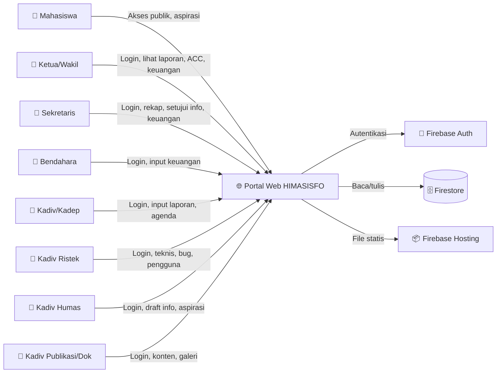
```mermaid
flowchart LR
    Mhs[👤 Mahasiswa]
    Ketua[👤 Ketua/Wakil]
    Sekum[👤 Sekretaris]
    Bend[👤 Bendahara]
    Kadiv[👤 Kadiv/Kadep]
    Ristek[👤 Kadiv Ristek]
    Humas[👤 Kadiv Humas]
    Pubdok[👤 Kadiv Publikasi/Dok]
    Web[🌐 Portal Web HIMASISFO]
    Auth[🔐 Firebase Auth]
    DB[(🗄️ Firestore)]
    Host[📦 Firebase Hosting]

    Mhs -->|Akses publik, aspirasi| Web
    Ketua -->|Login, lihat laporan, ACC, keuangan| Web
    Sekum -->|Login, rekap, setujui info, keuangan| Web
    Bend -->|Login, input keuangan| Web
    Kadiv -->|Login, input laporan, agenda| Web
    Ristek -->|Login, teknis, bug, pengguna| Web
    Humas -->|Login, draft info, aspirasi| Web
    Pubdok -->|Login, konten, galeri| Web
    Web -->|Autentikasi| Auth
    Web -->|Baca/tulis| DB
    Web -->|File statis| Host
```

### **7.2 Component Diagram (Frontend React)**

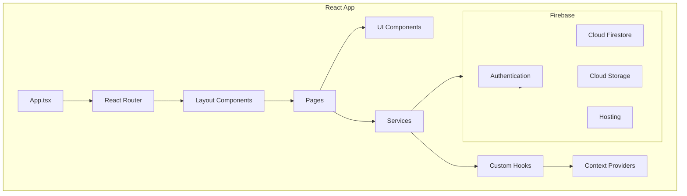
```mermaid
graph TD
    subgraph React App
        App[App.tsx]
        Router[React Router]
        Layout[Layout Components]
        Pages[Pages]
        Components[UI Components]
        Services[Services]
        Hooks[Custom Hooks]
        Context[Context Providers]

        App --> Router
        Router --> Layout
        Layout --> Pages
        Pages --> Components
        Pages --> Services
        Services --> Hooks
        Hooks --> Context
        Services --> Firebase[Firebase SDK]
    end

    subgraph Firebase
        Auth[Authentication]
        Firestore[Cloud Firestore]
        Storage[Cloud Storage]
        Hosting[Hosting]
    end

    Firebase --> Auth
    Firebase --> Firestore
    Firebase --> Storage
    Firebase --> Hosting
```

### **7.3 Data Flow Diagram Level 1**

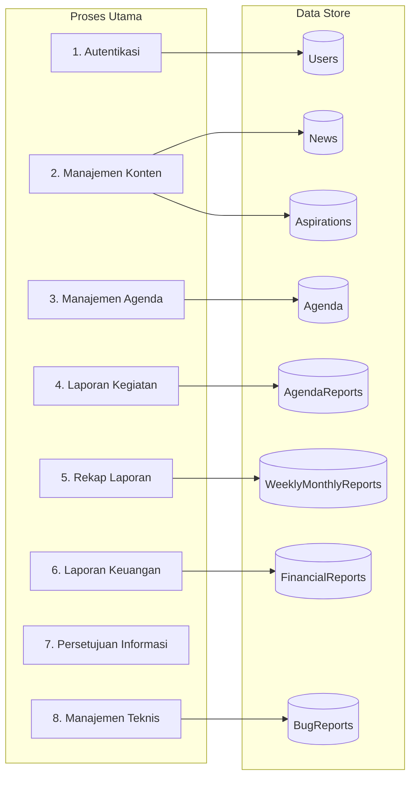
```mermaid
flowchart LR
    subgraph Proses Utama
        P1[1. Autentikasi]
        P2[2. Manajemen Konten]
        P3[3. Manajemen Agenda]
        P4[4. Laporan Kegiatan]
        P5[5. Rekap Laporan]
        P6[6. Laporan Keuangan]
        P7[7. Persetujuan Informasi]
        P8[8. Manajemen Teknis]
    end

    subgraph Data Store
        D1[(Users)]
        D2[(News)]
        D3[(Agenda)]
        D4[(AgendaReports)]
        D5[(WeeklyMonthlyReports)]
        D6[(FinancialReports)]
        D7[(Aspirations)]
        D8[(BugReports)]
    end

    P1 --> D1
    P2 --> D2
    P3 --> D3
    P4 --> D4
    P5 --> D5
    P6 --> D6
    P2 --> D7
    P8 --> D8
```

---

## **8. Diagram UML**

### **8.1 Use Case Diagram**


```mermaid
graph TD
    subgraph Aktor
        Mhs((Mahasiswa))
        Ketua((Ketua/Wakil))
        Sekum((Sekretaris))
        Bend((Bendahara))
        Kadiv((Kadiv/Kadep))
        Ristek((Kadiv Ristek))
        Humas((Kadiv Humas))
        Pubdok((Kadiv Publikasi/Dok & MEDINFO))
    end

    subgraph Portal Web HIMASISFO
        UC1[Lihat Beranda]
        UC2[Lihat Profil Organisasi]
        UC3[Baca Berita]
        UC4[Lihat Galeri]
        UC5[Kirim Aspirasi]
        UC6[Kelola Berita]
        UC7[Kelola Galeri]
        UC8[Kelola Struktur]
        UC9[Lihat Aspirasi]
        UC10[Kelola Link Penting]
        UC11[Kelola Agenda Unit Sendiri]
        UC12[Kelola Agenda Semua Unit]
        UC13[Input Laporan Agenda]
        UC14[Lihat Laporan Agenda]
        UC15[Buat Rekap Mingguan]
        UC16[Buat Rekap Bulanan]
        UC17[Lihat Rekap]
        UC18[Input Laporan Keuangan]
        UC19[Lihat Laporan Keuangan]
        UC20[Buat Draft Informasi]
        UC21[Setujui Informasi]
        UC22[ACC Informasi]
        UC23[Kelola Log Bug]
        UC24[Manajemen Pengguna]
        UC25[Pengaturan Website]
    end

    Mhs --> UC1
    Mhs --> UC2
    Mhs --> UC3
    Mhs --> UC4
    Mhs --> UC5

    Pubdok --> UC6
    Pubdok --> UC7
    Pubdok --> UC8
    Pubdok --> UC10

    Humas --> UC9
    Humas --> UC20

    Kadiv --> UC11
    Kadiv --> UC13
    Kadiv --> UC14

    Sekum --> UC12
    Sekum --> UC13
    Sekum --> UC14
    Sekum --> UC15
    Sekum --> UC16
    Sekum --> UC17
    Sekum --> UC19
    Sekum --> UC21

    Ketua --> UC14
    Ketua --> UC17
    Ketua --> UC19
    Ketua --> UC22

    Bend --> UC18
    Bend --> UC19

    Ristek --> UC6
    Ristek --> UC7
    Ristek --> UC8
    Ristek --> UC9
    Ristek --> UC10
    Ristek --> UC12
    Ristek --> UC13
    Ristek --> UC14
    Ristek --> UC15
    Ristek --> UC16
    Ristek --> UC17
    Ristek --> UC23
    Ristek --> UC24
    Ristek --> UC25
```

### **8.2 Activity Diagram — Login**

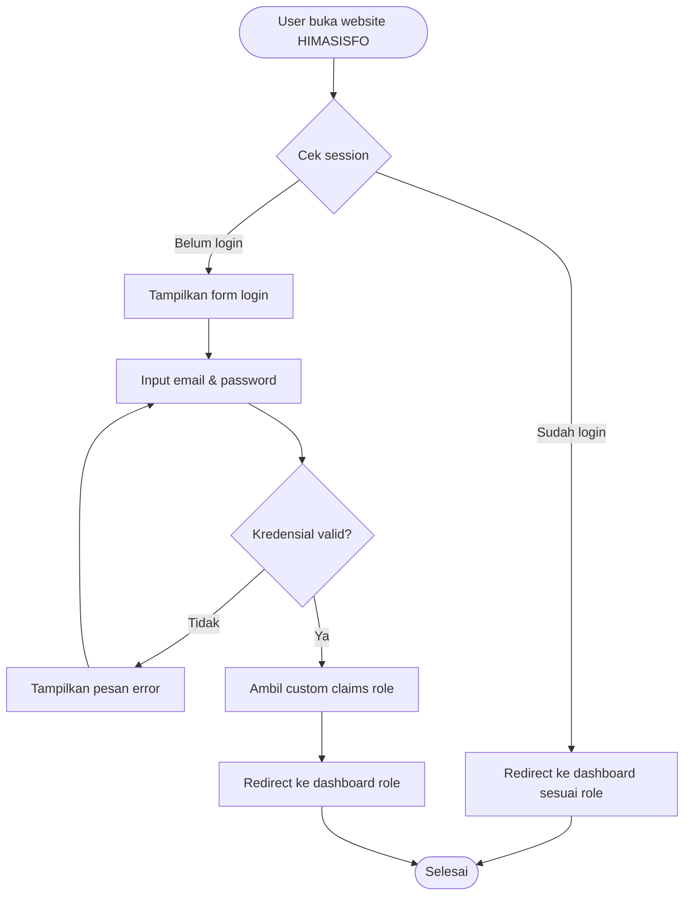
```mermaid
flowchart TD
    Start([User buka website HIMASISFO]) --> CheckAuth{Cek session}
    CheckAuth -->|Sudah login| Dashboard[Redirect ke dashboard sesuai role]
    CheckAuth -->|Belum login| TampilForm[Tampilkan form login]
    TampilForm --> Input[Input email & password]
    Input --> Validasi{Kredensial valid?}
    Validasi -->|Tidak| TampilError[Tampilkan pesan error]
    TampilError --> Input
    Validasi -->|Ya| AmbilRole[Ambil custom claims role]
    AmbilRole --> Redirect[Redirect ke dashboard role]
    Dashboard --> End
    Redirect --> End([Selesai])
```

### **8.3 Activity Diagram — Reset Password**

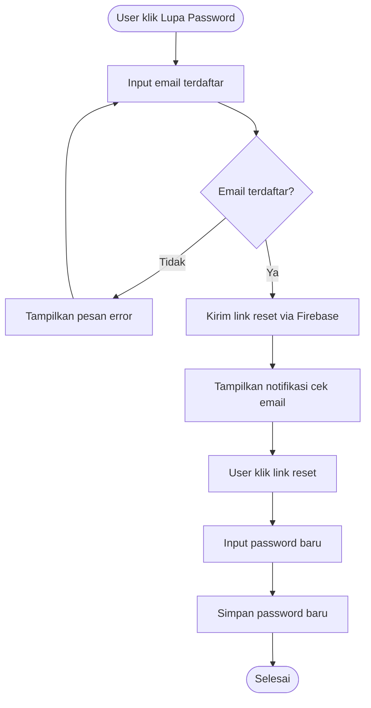
```mermaid
flowchart TD
    Start([User klik Lupa Password]) --> InputEmail[Input email terdaftar]
    InputEmail --> Validasi{Email terdaftar?}
    Validasi -->|Tidak| TampilError[Tampilkan pesan error]
    TampilError --> InputEmail
    Validasi -->|Ya| KirimLink[Kirim link reset via Firebase]
    KirimLink --> Notif[Tampilkan notifikasi cek email]
    Notif --> KlikLink[User klik link reset]
    KlikLink --> InputBaru[Input password baru]
    InputBaru --> Simpan[Simpan password baru]
    Simpan --> End([Selesai])
```

### **8.4 Activity Diagram — Manajemen Agenda**

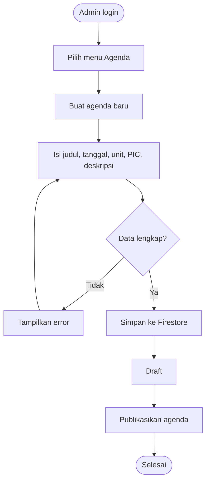
```mermaid
flowchart TD
    Start([Admin login]) --> PilihMenu[Pilih menu Agenda]
    PilihMenu --> TambahBaru[Buat agenda baru]
    TambahBaru --> IsiForm[Isi judul, tanggal, unit, PIC, deskripsi]
    IsiForm --> Validasi{Data lengkap?}
    Validasi -->|Tidak| TampilError[Tampilkan error]
    TampilError --> IsiForm
    Validasi -->|Ya| Simpan[Simpan ke Firestore]
    Simpan --> Status[Draft]
    Status --> Publish[Publikasikan agenda]
    Publish --> End([Selesai])
```

### **8.5 Activity Diagram — Rekap Mingguan/Bulanan**

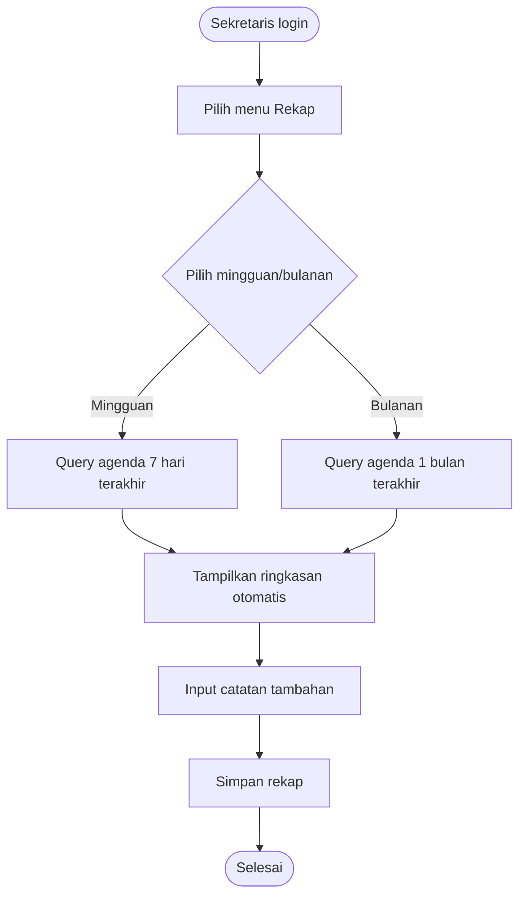
```mermaid
flowchart TD
    Start([Sekretaris login]) --> PilihMenu[Pilih menu Rekap]
    PilihMenu --> PilihJenis{Pilih mingguan/bulanan}
    PilihJenis -->|Mingguan| QueryMinggu[Query agenda 7 hari terakhir]
    PilihJenis -->|Bulanan| QueryBulan[Query agenda 1 bulan terakhir]
    QueryMinggu --> TampilRingkasan[Tampilkan ringkasan otomatis]
    QueryBulan --> TampilRingkasan
    TampilRingkasan --> TambahCatatan[Input catatan tambahan]
    TambahCatatan --> Simpan[Simpan rekap]
    Simpan --> End([Selesai])
```

### **8.6 Activity Diagram — Manajemen Pengguna (Ristek)**

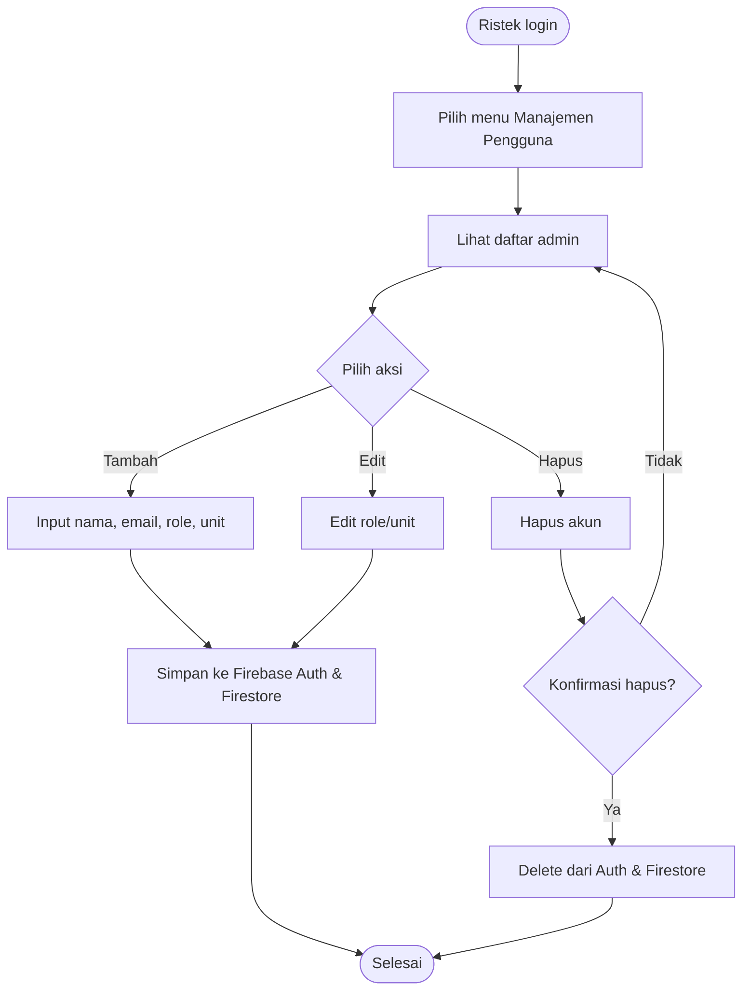
```mermaid
flowchart TD
    Start([Ristek login]) --> PilihMenu[Pilih menu Manajemen Pengguna]
    PilihMenu --> LihatDaftar[Lihat daftar admin]
    LihatDaftar --> PilihAksi{Pilih aksi}
    PilihAksi -->|Tambah| InputData[Input nama, email, role, unit]
    PilihAksi -->|Edit| EditData[Edit role/unit]
    PilihAksi -->|Hapus| HapusUser[Hapus akun]
    InputData --> Simpan[Simpan ke Firebase Auth & Firestore]
    EditData --> Simpan
    HapusUser --> Konfirmasi{Konfirmasi hapus?}
    Konfirmasi -->|Ya| Hapus[Delete dari Auth & Firestore]
    Konfirmasi -->|Tidak| LihatDaftar
    Simpan --> End
    Hapus --> End([Selesai])
```

### **8.7 Activity Diagram — Alur Persetujuan Informasi Humas**

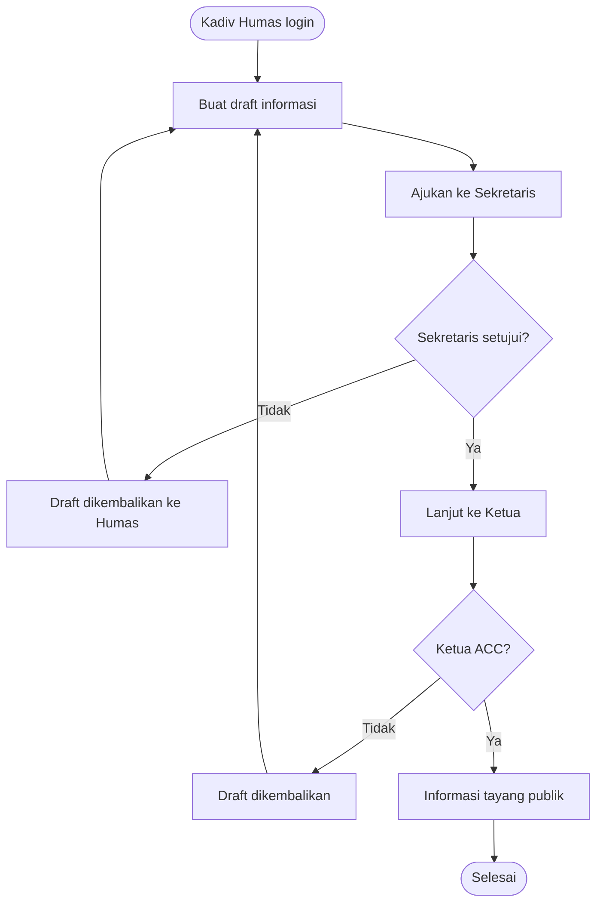
```mermaid
flowchart TD
    Start([Kadiv Humas login]) --> BuatDraft[Buat draft informasi]
    BuatDraft --> Ajukan[Ajukan ke Sekretaris]
    Ajukan --> CekSekum{Sekretaris setujui?}
    CekSekum -->|Tidak| TolakSekum[Draft dikembalikan ke Humas]
    TolakSekum --> BuatDraft
    CekSekum -->|Ya| LanjutKetua[Lanjut ke Ketua]
    LanjutKetua --> CekKetua{Ketua ACC?}
    CekKetua -->|Tidak| TolakKetua[Draft dikembalikan]
    TolakKetua --> BuatDraft
    CekKetua -->|Ya| Terbit[Informasi tayang publik]
    Terbit --> End([Selesai])
```

### **8.8 Activity Diagram — Input Laporan Keuangan Bendahara**

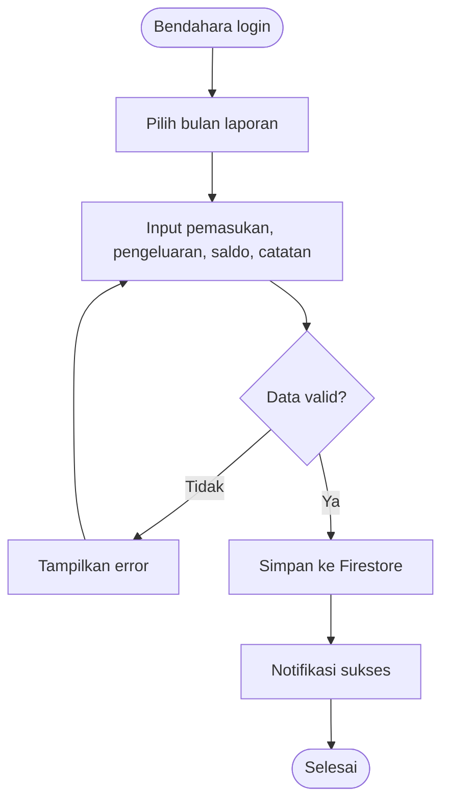
```mermaid
flowchart TD
    Start([Bendahara login]) --> PilihBulan[Pilih bulan laporan]
    PilihBulan --> InputData[Input pemasukan, pengeluaran, saldo, catatan]
    InputData --> Validasi{Data valid?}
    Validasi -->|Tidak| TampilError[Tampilkan error]
    TampilError --> InputData
    Validasi -->|Ya| Simpan[Simpan ke Firestore]
    Simpan --> Notif[Notifikasi sukses]
    Notif --> End([Selesai])
```

### **8.9 Sequence Diagram — Login**

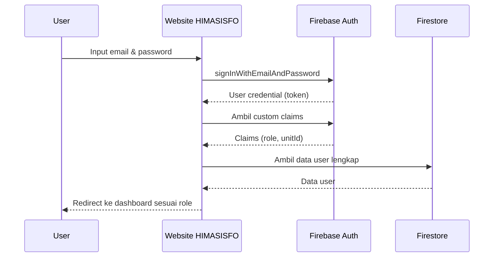
```mermaid
sequenceDiagram
    participant U as User
    participant W as Website HIMASISFO
    participant A as Firebase Auth
    participant F as Firestore

    U->>W: Input email & password
    W->>A: signInWithEmailAndPassword
    A-->>W: User credential (token)
    W->>A: Ambil custom claims
    A-->>W: Claims (role, unitId)
    W->>F: Ambil data user lengkap
    F-->>W: Data user
    W-->>U: Redirect ke dashboard sesuai role
```

### **8.10 Sequence Diagram — Alur Persetujuan Informasi Humas**

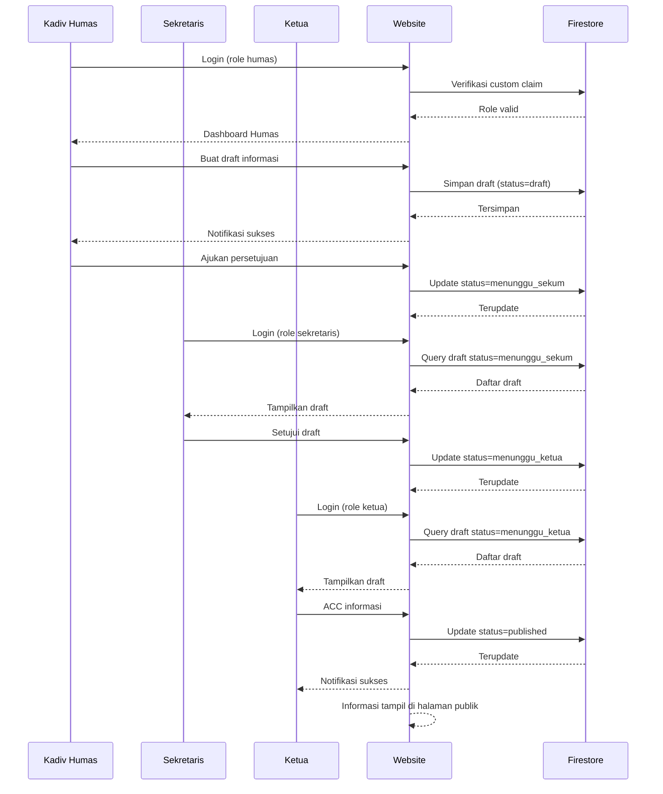
```mermaid
sequenceDiagram
    participant H as Kadiv Humas
    participant S as Sekretaris
    participant K as Ketua
    participant W as Website
    participant F as Firestore

    H->>W: Login (role humas)
    W->>F: Verifikasi custom claim
    F-->>W: Role valid
    W-->>H: Dashboard Humas

    H->>W: Buat draft informasi
    W->>F: Simpan draft (status=draft)
    F-->>W: Tersimpan
    W-->>H: Notifikasi sukses

    H->>W: Ajukan persetujuan
    W->>F: Update status=menunggu_sekum
    F-->>W: Terupdate

    S->>W: Login (role sekretaris)
    W->>F: Query draft status=menunggu_sekum
    F-->>W: Daftar draft
    W-->>S: Tampilkan draft

    S->>W: Setujui draft
    W->>F: Update status=menunggu_ketua
    F-->>W: Terupdate

    K->>W: Login (role ketua)
    W->>F: Query draft status=menunggu_ketua
    F-->>W: Daftar draft
    W-->>K: Tampilkan draft

    K->>W: ACC informasi
    W->>F: Update status=published
    F-->>W: Terupdate
    W-->>K: Notifikasi sukses
    W-->>W: Informasi tampil di halaman publik
```

### **8.11 Sequence Diagram — Lihat Laporan Keuangan (Sekretaris/Ketua/Wakil)**

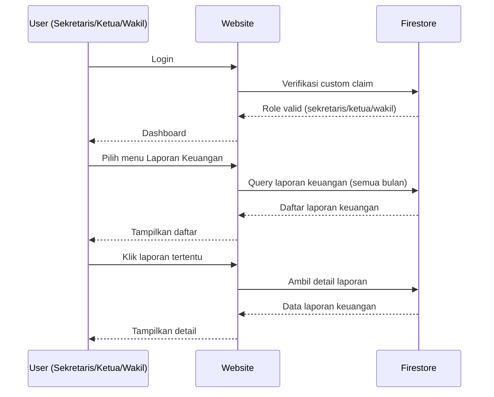
```mermaid
sequenceDiagram
    participant U as User (Sekretaris/Ketua/Wakil)
    participant W as Website
    participant F as Firestore

    U->>W: Login
    W->>F: Verifikasi custom claim
    F-->>W: Role valid (sekretaris/ketua/wakil)
    W-->>U: Dashboard

    U->>W: Pilih menu Laporan Keuangan
    W->>F: Query laporan keuangan (semua bulan)
    F-->>W: Daftar laporan keuangan
    W-->>U: Tampilkan daftar

    U->>W: Klik laporan tertentu
    W->>F: Ambil detail laporan
    F-->>W: Data laporan keuangan
    W-->>U: Tampilkan detail
```

### **8.12 Class Diagram (Model Data Konseptual)**

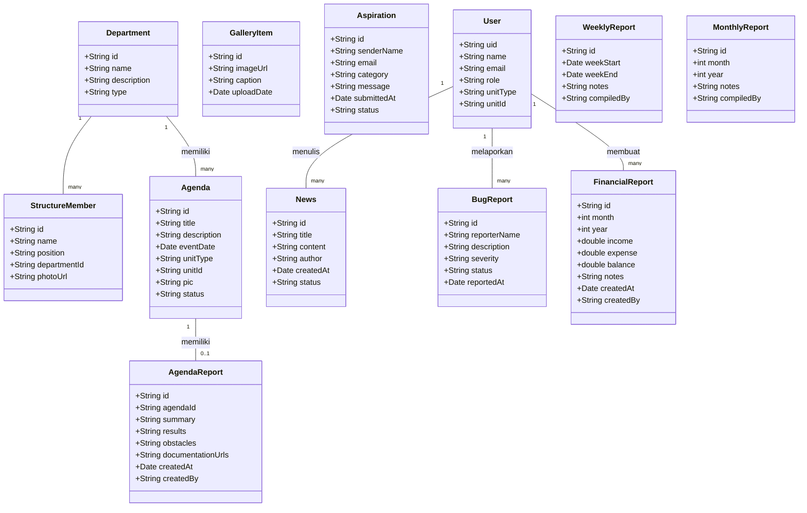
```mermaid
classDiagram
    class User {
        +String uid
        +String name
        +String email
        +String role
        +String unitType
        +String unitId
    }
    class News {
        +String id
        +String title
        +String content
        +String author
        +Date createdAt
        +String status
    }
    class GalleryItem {
        +String id
        +String imageUrl
        +String caption
        +Date uploadDate
    }
    class Aspiration {
        +String id
        +String senderName
        +String email
        +String category
        +String message
        +Date submittedAt
        +String status
    }
    class Department {
        +String id
        +String name
        +String description
        +String type
    }
    class StructureMember {
        +String id
        +String name
        +String position
        +String departmentId
        +String photoUrl
    }
    class Agenda {
        +String id
        +String title
        +String description
        +Date eventDate
        +String unitType
        +String unitId
        +String pic
        +String status
    }
    class AgendaReport {
        +String id
        +String agendaId
        +String summary
        +String results
        +String obstacles
        +String documentationUrls
        +Date createdAt
        +String createdBy
    }
    class WeeklyReport {
        +String id
        +Date weekStart
        +Date weekEnd
        +String notes
        +String compiledBy
    }
    class MonthlyReport {
        +String id
        +int month
        +int year
        +String notes
        +String compiledBy
    }
    class FinancialReport {
        +String id
        +int month
        +int year
        +double income
        +double expense
        +double balance
        +String notes
        +Date createdAt
        +String createdBy
    }
    class BugReport {
        +String id
        +String reporterName
        +String description
        +String severity
        +String status
        +Date reportedAt
    }

    Department "1" -- "many" StructureMember
    User "1" -- "many" News : menulis
    Agenda "1" -- "0..1" AgendaReport : memiliki
    User "1" -- "many" BugReport : melaporkan
    Department "1" -- "many" Agenda : memiliki
    User "1" -- "many" FinancialReport : membuat
```

### **8.13 State Diagram — Status Informasi (Alur Persetujuan Humas)**

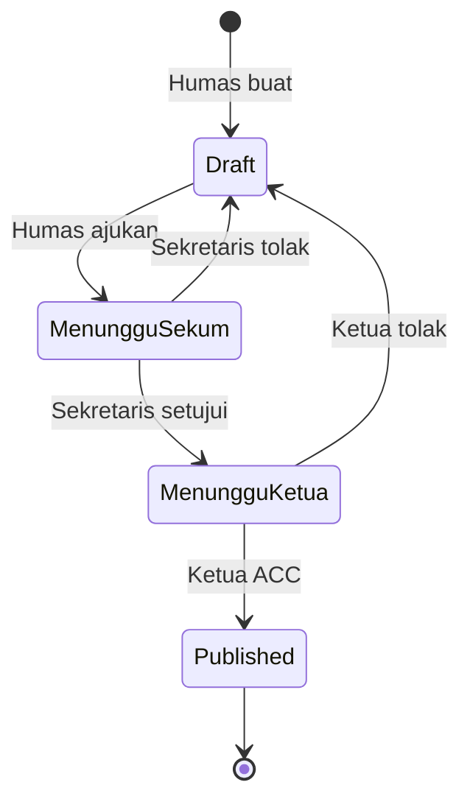
```mermaid
stateDiagram-v2
    [*] --> Draft : Humas buat
    Draft --> MenungguSekum : Humas ajukan
    MenungguSekum --> Draft : Sekretaris tolak
    MenungguSekum --> MenungguKetua : Sekretaris setujui
    MenungguKetua --> Draft : Ketua tolak
    MenungguKetua --> Published : Ketua ACC
    Published --> [*]
```

### **8.14 State Diagram — Status Bug Report**

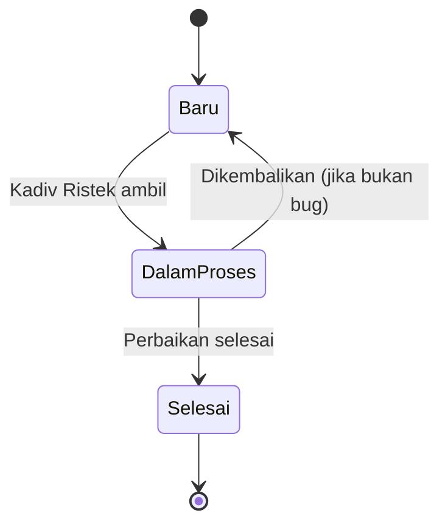
```mermaid
stateDiagram-v2
    [*] --> Baru
    Baru --> DalamProses : Kadiv Ristek ambil
    DalamProses --> Selesai : Perbaikan selesai
    DalamProses --> Baru : Dikembalikan (jika bukan bug)
    Selesai --> [*]
```

---

## **9. Entity Relationship Diagram (ERD)**

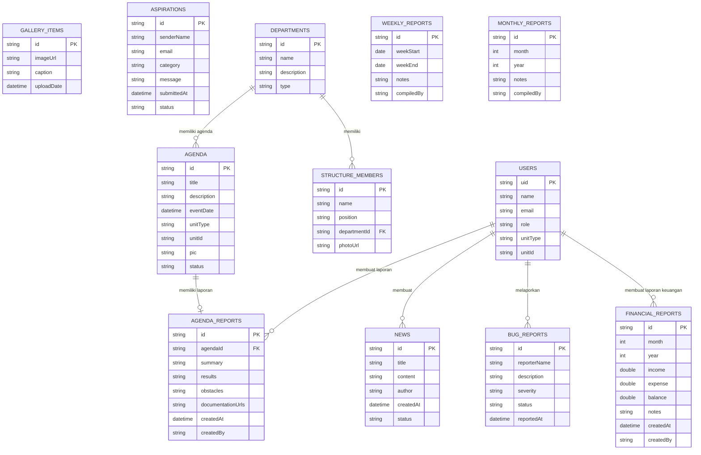
```mermaid
erDiagram
    USERS {
        string uid PK
        string name
        string email
        string role
        string unitType
        string unitId
    }
    NEWS {
        string id PK
        string title
        string content
        string author
        datetime createdAt
        string status
    }
    GALLERY_ITEMS {
        string id PK
        string imageUrl
        string caption
        datetime uploadDate
    }
    ASPIRATIONS {
        string id PK
        string senderName
        string email
        string category
        string message
        datetime submittedAt
        string status
    }
    DEPARTMENTS {
        string id PK
        string name
        string description
        string type
    }
    STRUCTURE_MEMBERS {
        string id PK
        string name
        string position
        string departmentId FK
        string photoUrl
    }
    AGENDA {
        string id PK
        string title
        string description
        datetime eventDate
        string unitType
        string unitId
        string pic
        string status
    }
    AGENDA_REPORTS {
        string id PK
        string agendaId FK
        string summary
        string results
        string obstacles
        string documentationUrls
        datetime createdAt
        string createdBy
    }
    WEEKLY_REPORTS {
        string id PK
        date weekStart
        date weekEnd
        string notes
        string compiledBy
    }
    MONTHLY_REPORTS {
        string id PK
        int month
        int year
        string notes
        string compiledBy
    }
    FINANCIAL_REPORTS {
        string id PK
        int month
        int year
        double income
        double expense
        double balance
        string notes
        datetime createdAt
        string createdBy
    }
    BUG_REPORTS {
        string id PK
        string reporterName
        string description
        string severity
        string status
        datetime reportedAt
    }

    DEPARTMENTS ||--o{ STRUCTURE_MEMBERS : "memiliki"
    USERS ||--o{ NEWS : "membuat"
    AGENDA ||--o| AGENDA_REPORTS : "memiliki laporan"
    USERS ||--o{ BUG_REPORTS : "melaporkan"
    DEPARTMENTS ||--o{ AGENDA : "memiliki agenda"
    USERS ||--o{ AGENDA_REPORTS : "membuat laporan"
    USERS ||--o{ FINANCIAL_REPORTS : "membuat laporan keuangan"
```

---

## **10. Flowchart — Alur Persetujuan Informasi Humas**

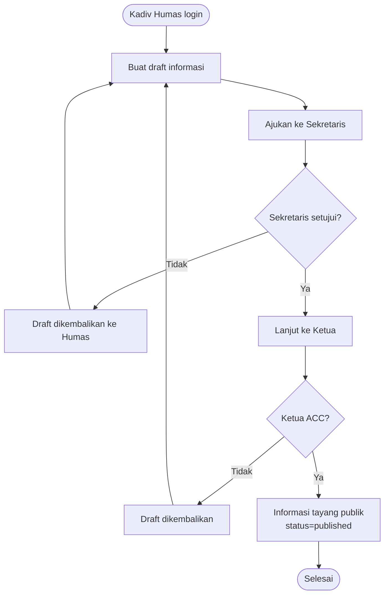
```mermaid
flowchart TD
    Start([Kadiv Humas login]) --> BuatDraft[Buat draft informasi]
    BuatDraft --> Ajukan[Ajukan ke Sekretaris]
    Ajukan --> CekSekum{Sekretaris setujui?}
    CekSekum -->|Tidak| Kembali1[Draft dikembalikan ke Humas]
    Kembali1 --> BuatDraft
    CekSekum -->|Ya| Lanjut[Lanjut ke Ketua]
    Lanjut --> CekKetua{Ketua ACC?}
    CekKetua -->|Tidak| Kembali2[Draft dikembalikan]
    Kembali2 --> BuatDraft
    CekKetua -->|Ya| Terbit[Informasi tayang publik<br/>status=published]
    Terbit --> End([Selesai])
```

---

## **11. Flow Map — Distribusi Hak Akses Laporan Keuangan & Informasi**

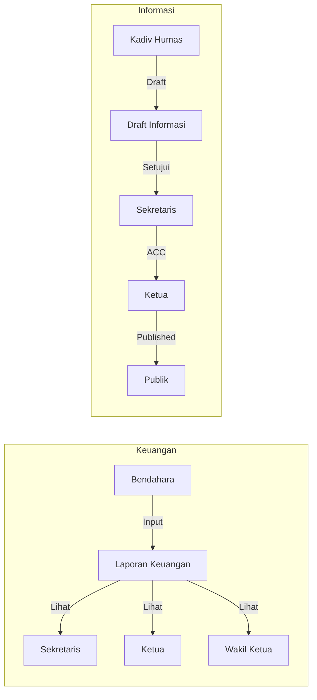
```mermaid
flowchart LR
    subgraph Keuangan
        B[Bendahara] -->|Input| FR[Laporan Keuangan]
        FR -->|Lihat| S[Sekretaris]
        FR -->|Lihat| K[Ketua]
        FR -->|Lihat| W[Wakil Ketua]
    end

    subgraph Informasi
        H[Kadiv Humas] -->|Draft| D[Draft Informasi]
        D -->|Setujui| S2[Sekretaris]
        S2 -->|ACC| K2[Ketua]
        K2 -->|Published| P[Publik]
    end
```

---

## **12. Deployment Diagram**

```mermaid
graph TD
    subgraph Client
        Browser[Browser Mahasiswa/Admin]
    end

    subgraph Firebase Cloud
        Hosting[Firebase Hosting<br/>CDN + SSL]
        Auth[Firebase Authentication<br/>Custom Claims]
        Firestore[Cloud Firestore<br/>Database dengan aturan keamanan berbasis role]
    end

    Browser -->|HTTPS| Hosting
    Browser -->|REST API| Auth
    Browser -->|REST API| Firestore
    Hosting -->|File statis| Browser
```

---

## **13. Spesifikasi Teknis**

### **13.1 Struktur Folder Proyek**

```
├── public/
│   ├── favicon.ico
│   └── manifest.json
├── src/
│   ├── assets/
│   │   ├── images/
│   │   └── styles/
│   ├── components/
│   │   ├── common/
│   │   │   ├── Button.tsx
│   │   │   ├── Card.tsx
│   │   │   ├── Modal.tsx
│   │   │   └── Table.tsx
│   │   ├── layout/
│   │   │   ├── Navbar.tsx
│   │   │   ├── Footer.tsx
│   │   │   └── Sidebar.tsx
│   │   └── forms/
│   │       ├── AgendaForm.tsx
│   │       ├── ReportForm.tsx
│   │       └── FinancialForm.tsx
│   ├── pages/
│   │   ├── public/
│   │   │   ├── Beranda.tsx
│   │   │   ├── Profil.tsx
│   │   │   ├── Berita.tsx
│   │   │   ├── Galeri.tsx
│   │   │   └── Aspirasi.tsx
│   │   └── admin/
│   │       ├── Dashboard.tsx
│   │       ├── AgendaPage.tsx
│   │       ├── LaporanPage.tsx
│   │       ├── KeuanganPage.tsx
│   │       ├── PersetujuanPage.tsx
│   │       ├── GaleriPage.tsx
│   │       ├── BugPage.tsx
│   │       └── PenggunaPage.tsx
│   ├── services/
│   │   ├── firebase.ts
│   │   ├── authService.ts
│   │   ├── agendaService.ts
│   │   ├── reportService.ts
│   │   ├── financeService.ts
│   │   └── newsService.ts
│   ├── hooks/
│   │   ├── useAuth.ts
│   │   ├── useAgenda.ts
│   │   └── useFirestore.ts
│   ├── context/
│   │   └── AuthContext.tsx
│   ├── utils/
│   │   ├── constants.ts
│   │   └── helpers.ts
│   ├── App.tsx
│   └── main.tsx
├── .env
├── .gitignore
├── firebase.json
├── package.json
├── tailwind.config.js
└── vite.config.ts
```

### **13.2 Skema Firestore (Collection & Field Detail)**

#### **Collection: `users`**
| Field | Tipe | Deskripsi |
|-------|------|-----------|
| `uid` | string | UID dari Firebase Auth |
| `name` | string | Nama lengkap |
| `email` | string | Email terdaftar |
| `role` | string | `ketua`, `wakil`, `sekretaris`, `bendahara`, `kadiv`, `kadep`, `ristek`, `publikasi_dok`, `humas`, `medinfo` |
| `unitType` | string | `departemen` atau `divisi` |
| `unitId` | string | ID unit terkait (untuk kadiv/kadep) |
| `createdAt` | timestamp | Waktu pembuatan |

#### **Collection: `news`**
| Field | Tipe | Deskripsi |
|-------|------|-----------|
| `id` | string | Auto-generated |
| `title` | string | Judul informasi |
| `content` | string | Isi informasi |
| `author` | string | UID pembuat |
| `status` | string | `draft`, `menunggu_sekum`, `menunggu_ketua`, `published` |
| `createdAt` | timestamp | Waktu pembuatan |
| `publishedAt` | timestamp | Waktu publikasi |

#### **Collection: `galleryItems`**
| Field | Tipe | Deskripsi |
|-------|------|-----------|
| `id` | string | Auto-generated |
| `imageUrl` | string | URL gambar di Firebase Storage |
| `caption` | string | Keterangan foto |
| `category` | string | `kegiatan` atau `prestasi` |
| `uploadedBy` | string | UID pengunggah |
| `uploadDate` | timestamp | Waktu unggah |

#### **Collection: `aspirations`**
| Field | Tipe | Deskripsi |
|-------|------|-----------|
| `id` | string | Auto-generated |
| `senderName` | string | Nama pengirim |
| `email` | string | Email pengirim |
| `category` | string | Kategori aspirasi |
| `message` | string | Isi aspirasi |
| `status` | string | `baru`, `diproses`, `selesai` |
| `submittedAt` | timestamp | Waktu kirim |

#### **Collection: `departments`**
| Field | Tipe | Deskripsi |
|-------|------|-----------|
| `id` | string | Auto-generated |
| `name` | string | Nama departemen/divisi |
| `type` | string | `departemen` atau `divisi` |
| `parentId` | string | ID departemen induk (untuk divisi) |

#### **Collection: `structureMembers`**
| Field | Tipe | Deskripsi |
|-------|------|-----------|
| `id` | string | Auto-generated |
| `name` | string | Nama anggota |
| `position` | string | Jabatan |
| `departmentId` | string | ID departemen/divisi |
| `photoUrl` | string | URL foto |

#### **Collection: `agenda`**
| Field | Tipe | Deskripsi |
|-------|------|-----------|
| `id` | string | Auto-generated |
| `title` | string | Judul agenda |
| `description` | string | Deskripsi |
| `eventDate` | timestamp | Tanggal kegiatan |
| `unitType` | string | `departemen` atau `divisi` |
| `unitId` | string | ID unit penanggung jawab |
| `pic` | string | Nama PIC |
| `status` | string | `draft`, `published`, `reported` |

#### **Collection: `agendaReports`**
| Field | Tipe | Deskripsi |
|-------|------|-----------|
| `id` | string | Auto-generated |
| `agendaId` | string | ID agenda terkait |
| `summary` | string | Ringkasan |
| `results` | string | Hasil kegiatan |
| `obstacles` | string | Kendala |
| `documentationUrls` | array | URL dokumentasi |
| `createdAt` | timestamp | Waktu pembuatan |
| `createdBy` | string | UID pembuat |

#### **Collection: `weeklyReports`**
| Field | Tipe | Deskripsi |
|-------|------|-----------|
| `id` | string | Auto-generated |
| `weekStart` | date | Tanggal awal minggu |
| `weekEnd` | date | Tanggal akhir minggu |
| `notes` | string | Catatan tambahan |
| `compiledBy` | string | UID Sekretaris |
| `createdAt` | timestamp | Waktu pembuatan |

#### **Collection: `monthlyReports`**
| Field | Tipe | Deskripsi |
|-------|------|-----------|
| `id` | string | Auto-generated |
| `month` | number | Bulan (1-12) |
| `year` | number | Tahun |
| `notes` | string | Catatan tambahan |
| `compiledBy` | string | UID Sekretaris |
| `createdAt` | timestamp | Waktu pembuatan |

#### **Collection: `financialReports`**
| Field | Tipe | Deskripsi |
|-------|------|-----------|
| `id` | string | Auto-generated |
| `month` | number | Bulan |
| `year` | number | Tahun |
| `income` | number | Total pemasukan |
| `expense` | number | Total pengeluaran |
| `balance` | number | Saldo akhir |
| `notes` | string | Catatan |
| `createdBy` | string | UID Bendahara |
| `createdAt` | timestamp | Waktu pembuatan |

#### **Collection: `bugReports`**
| Field | Tipe | Deskripsi |
|-------|------|-----------|
| `id` | string | Auto-generated |
| `reporterName` | string | Nama pelapor |
| `description` | string | Deskripsi bug |
| `severity` | string | `ringan`, `sedang`, `berat` |
| `status` | string | `baru`, `dalam_proses`, `selesai` |
| `reportedAt` | timestamp | Waktu lapor |

### **13.3 Aturan Keamanan Firestore (Security Rules)**

```
rules_version = '2';
service cloud.firestore {
  match /databases/{database}/documents {
    
    // Helper functions
    function isSignedIn() {
      return request.auth != null;
    }
    
    function hasRole(role) {
      return isSignedIn() && request.auth.token.role == role;
    }
    
    function isOneOfRoles(roles) {
      return isSignedIn() && roles.contains(request.auth.token.role);
    }
    
    function isUnitOwner(unitId) {
      return isSignedIn() && request.auth.token.unitId == unitId;
    }
    
    // Users (hanya Ristek yang bisa kelola)
    match /users/{userId} {
      allow read: if isSignedIn();
      allow write: if hasRole('ristek');
    }
    
    // News (publik bisa baca yang published, admin kelola)
    match /news/{newsId} {
      allow read: if resource.data.status == 'published' || isSignedIn();
      allow create: if isOneOfRoles(['humas', 'ristek', 'publikasi_dok', 'medinfo']);
      allow update: if isOneOfRoles(['humas', 'ristek', 'sekretaris', 'ketua', 'publikasi_dok', 'medinfo']);
      allow delete: if hasRole('ristek');
    }
    
    // Gallery (publik baca, publikasi/ristek upload)
    match /galleryItems/{itemId} {
      allow read: if true;
      allow write: if isOneOfRoles(['ristek', 'publikasi_dok', 'medinfo']);
    }
    
    // Aspirations (publik buat, humas/ristek baca)
    match /aspirations/{aspirationId} {
      allow read: if isOneOfRoles(['ristek', 'humas']);
      allow create: if true;
      allow update, delete: if hasRole('ristek');
    }
    
    // Departments & Structure (publik baca, ristek/publikasi kelola)
    match /departments/{deptId} {
      allow read: if true;
      allow write: if isOneOfRoles(['ristek', 'publikasi_dok']);
    }
    match /structureMembers/{memberId} {
      allow read: if true;
      allow write: if isOneOfRoles(['ristek', 'publikasi_dok']);
    }
    
    // Agenda (publik baca published, kadiv/kadep kelola unitnya, sekretaris/ristek semua)
    match /agenda/{agendaId} {
      allow read: if resource.data.status == 'published' || isSignedIn();
      allow create: if isSignedIn();
      allow update: if isUnitOwner(resource.data.unitId) || isOneOfRoles(['sekretaris', 'ristek']);
      allow delete: if hasRole('ristek');
    }
    
    // Agenda Reports (kadiv/kadep unitnya, sekretaris/ristek semua)
    match /agendaReports/{reportId} {
      allow read: if isSignedIn();
      allow create: if isSignedIn();
      allow update: if isUnitOwner(resource.data.unitId) || isOneOfRoles(['sekretaris', 'ristek']);
      allow delete: if hasRole('ristek');
    }
    
    // Weekly/Monthly Reports (sekretaris buat, ketua/wakil/ristek baca)
    match /weeklyReports/{reportId} {
      allow read: if isOneOfRoles(['sekretaris', 'ketua', 'wakil', 'ristek']);
      allow write: if hasRole('sekretaris');
    }
    match /monthlyReports/{reportId} {
      allow read: if isOneOfRoles(['sekretaris', 'ketua', 'wakil', 'ristek']);
      allow write: if hasRole('sekretaris');
    }
    
    // Financial Reports (bendahara kelola, sekretaris/ketua/wakil baca)
    match /financialReports/{reportId} {
      allow read: if isOneOfRoles(['bendahara', 'sekretaris', 'ketua', 'wakil']);
      allow write: if hasRole('bendahara');
    }
    
    // Bug Reports (semua bisa lapor, ristek kelola)
    match /bugReports/{bugId} {
      allow read: if hasRole('ristek');
      allow create: if isSignedIn();
      allow update, delete: if hasRole('ristek');
    }
  }
}
```

### **13.4 Daftar Custom Claims Firebase Auth**

| Role | Custom Claims | Keterangan |
|------|---------------|------------|
| **Ketua** | `{ role: "ketua" }` | Pimpinan tertinggi |
| **Wakil Ketua** | `{ role: "wakil" }` | Pendamping ketua |
| **Sekretaris** | `{ role: "sekretaris" }` | Pengelola laporan pusat |
| **Bendahara** | `{ role: "bendahara" }` | Pengelola keuangan |
| **Kadiv Ristek** | `{ role: "ristek", unitType: "divisi", unitId: "ristek" }` | Super admin teknis |
| **Kadiv Kompetensi** | `{ role: "kadiv", unitType: "divisi", unitId: "kompetensi" }` | Input laporan divisi |
| **Kadiv Kaderisasi** | `{ role: "kadiv", unitType: "divisi", unitId: "kaderisasi" }` | Input laporan divisi |
| **Kadiv Kesekretariatan** | `{ role: "kadiv", unitType: "divisi", unitId: "kesekretariatan" }` | Input laporan divisi |
| **Kadiv Kewirausahaan** | `{ role: "kadiv", unitType: "divisi", unitId: "kewirausahaan" }` | Input laporan divisi |
| **Kadiv Humas** | `{ role: "humas", unitType: "divisi", unitId: "humas_kemitraan" }` | Draft informasi |
| **Kadiv Publikasi** | `{ role: "publikasi_dok", unitType: "divisi", unitId: "publikasi_dok" }` | Kelola konten & galeri |
| **Kadep PSDM** | `{ role: "kadep", unitType: "departemen", unitId: "psdm" }` | Input laporan departemen |
| **Kadep ADKWU** | `{ role: "kadep", unitType: "departemen", unitId: "adkwu" }` | Input laporan departemen |
| **Kadep MEDINFO** | `{ role: "medinfo", unitType: "departemen", unitId: "medinfo" }` | Input laporan, kelola media |

### **13.5 Environment Variables (.env)**

```env
# Firebase Configuration
VITE_FIREBASE_API_KEY=your_api_key
VITE_FIREBASE_AUTH_DOMAIN=your_project.firebaseapp.com
VITE_FIREBASE_PROJECT_ID=your_project_id
VITE_FIREBASE_STORAGE_BUCKET=your_project.appspot.com
VITE_FIREBASE_MESSAGING_SENDER_ID=your_sender_id
VITE_FIREBASE_APP_ID=your_app_id
VITE_FIREBASE_MEASUREMENT_ID=your_measurement_id

# Firebase Hosting
VITE_FIREBASE_HOSTING_URL=https://your_project.web.app

# Analytics (opsional)
VITE_ENABLE_ANALYTICS=false
```

---

## **14. Mockup / Wireframe Sederhana**

### **14.1 Beranda (Publik)**

```
┌─────────────────────────────────────────────────────┐
│  LOGO   HIMASISFO    [Profil] [Berita] [Galeri] [Aspirasi]  │
├─────────────────────────────────────────────────────┤
│  ┌──────────────────────────────────────────────┐   │
│  │       SAMBUTAN KETUA HIMASISFO             │   │
│  │       "Selamat datang di portal..."        │   │
│  │       [Foto Ketua]                         │   │
│  └──────────────────────────────────────────────┘   │
├─────────────────────────────────────────────────────┤
│  BERITA TERBARU                                     │
│  ┌──────────┐  ┌──────────┐  ┌──────────┐         │
│  │ Berita 1 │  │ Berita 2 │  │ Berita 3 │         │
│  │ [Gambar] │  │ [Gambar] │  │ [Gambar] │         │
│  └──────────┘  └──────────┘  └──────────┘         │
├─────────────────────────────────────────────────────┤
│  AKSES CEPAT: [Open Recruitment] [Modul] [Link]    │
│  Footer: © 2025 HIMASISFO                          │
└─────────────────────────────────────────────────────┘
```

### **14.2 Dashboard Admin (Umum)**

```
┌─────────────────────────────────────────────────────┐
│  LOGO   DASHBOARD ADMIN    [Profil] [Logout]       │
├──────────┬──────────────────────────────────────────┤
│ Sidebar  │  Selamat datang, [Nama]!               │
│          │  Role: [Role User]                      │
│ 📊 Agenda│  ┌────────────────────────────────────┐ │
│ 📝 Laporan│  │ Ringkasan Bulan Ini               │ │
│ 💰 Keuangan│  │ Agenda: 5 | Laporan: 4 | Bug: 1   │ │
│ 📰 Berita │  └────────────────────────────────────┘ │
│ 🖼️ Galeri │  ┌────────────────────────────────────┐ │
│ 🔧 Teknis │  │ Aktivitas Terbaru                  │ │
│          │  │ - Agenda baru dibuat               │ │
│          │  │ - Laporan diinput                   │ │
│          │  └────────────────────────────────────┘ │
└──────────┴──────────────────────────────────────────┘
```

### **14.3 Form Laporan Kegiatan**

```
┌─────────────────────────────────────────────────────┐
│  FORM LAPORAN KEGIATAN                              │
├─────────────────────────────────────────────────────┤
│  Agenda: [Dropdown pilih agenda]                    │
│  Ringkasan: [Textarea]                              │
│  Hasil: [Textarea]                                  │
│  Kendala: [Textarea]                                │
│  Dokumentasi: [Upload foto]                         │
│                                                     │
│  [Submit]  [Cancel]                                 │
└─────────────────────────────────────────────────────┘
```

### **14.4 Halaman Laporan Keuangan**

```
┌─────────────────────────────────────────────────────┐
│  LAPORAN KEUANGAN - BULAN JANUARI 2025              │
├─────────────────────────────────────────────────────┤
│  Pemasukan: Rp 5.000.000                           │
│  Pengeluaran: Rp 3.500.000                         │
│  Saldo: Rp 1.500.000                               │
├─────────────────────────────────────────────────────┤
│  Tabel Transaksi:                                   │
│  ┌──────┬──────────┬─────────┬──────────┬────────┐ │
│  │ No   │ Tanggal  │ Jenis   │ Jumlah   │ Catatan│ │
│  ├──────┼──────────┼─────────┼──────────┼────────┤ │
│  │ 1    │ 10/01    │ Masuk   │ 2.000.000│ Sponsor│ │
│  │ 2    │ 15/01    │ Keluar  │ 1.000.000│ Acara  │ │
│  └──────┴──────────┴─────────┴──────────┴────────┘ │
│                                                     │
│  [Tambah Transaksi]  [Edit]  [Hapus]                │
└─────────────────────────────────────────────────────┘
```

### **14.5 Halaman Persetujuan Informasi**

```
┌─────────────────────────────────────────────────────┐
│  DAFTAR INFORMASI MENUNGGU PERSETUJUAN              │
├─────────────────────────────────────────────────────┤
│  ┌──────────────────────────────────────────────┐   │
│  │ [Draft] Judul Informasi 1                    │   │
│  │ Oleh: Humas | Tanggal: 10/04/2025           │   │
│  │ Status: Menunggu Sekretaris                 │   │
│  │ [Setujui]  [Tolak]                          │   │
│  └──────────────────────────────────────────────┘   │
│  ┌──────────────────────────────────────────────┐   │
│  │ [Draft] Judul Informasi 2                    │   │
│  │ Oleh: Humas | Tanggal: 11/04/2025           │   │
│  │ Status: Menunggu Ketua                      │   │
│  │ [ACC]  [Tolak]                              │   │
│  └──────────────────────────────────────────────┘   │
└─────────────────────────────────────────────────────┘
```

---

## **15. Testing & Quality Assurance**

### **15.1 Test Cases**

| ID | Fitur | Skenario | Langkah | Hasil Diharapkan |
|----|-------|----------|---------|------------------|
| TC-01 | Login | Login berhasil | Input email/password valid → klik Login | Redirect ke dashboard sesuai role |
| TC-02 | Login | Login gagal | Input password salah | Tampilkan pesan error |
| TC-03 | Reset Password | Lupa password | Klik "Lupa Password" → input email → kirim link | Email reset terkirim |
| TC-04 | Agenda | Buat agenda | Kadiv login → buat agenda unit → simpan | Agenda tersimpan status draft |
| TC-05 | Agenda | Akses unit lain | Kadiv buka agenda unit lain | Tidak bisa edit, hanya baca |
| TC-06 | Laporan | Input laporan | Kadiv pilih agenda unit → isi laporan → simpan | Laporan tersimpan |
| TC-07 | Laporan | Akses laporan unit lain | Kadiv buka laporan unit lain | Akses ditolak |
| TC-08 | Rekap | Buat rekap mingguan | Sekretaris pilih rekap mingguan → tambah catatan → simpan | Rekap tersimpan |
| TC-09 | Keuangan | Input laporan | Bendahara input pemasukan/pengeluaran → simpan | Laporan tersimpan |
| TC-10 | Keuangan | Akses non-otorisasi | Kadiv coba akses keuangan | Akses ditolak |
| TC-11 | Keuangan | Lihat keuangan | Ketua login → buka menu keuangan | Lihat laporan keuangan |
| TC-12 | Informasi | Alur persetujuan | Humas buat draft → ajukan → Sekretaris setujui → Ketua ACC | Informasi published |
| TC-13 | Informasi | Tolak draft | Sekretaris tolak draft | Draft kembali ke Humas |
| TC-14 | Galeri | Upload foto | Publikasi/Dok upload foto kegiatan | Foto tampil di galeri publik |
| TC-15 | Galeri | Upload foto Ristek | Ristek upload foto prestasi | Foto tampil di galeri publik |
| TC-16 | Bug | Lapor bug | User isi form bug → submit | Bug tersimpan, Ristek bisa lihat |
| TC-17 | Pengguna | Tambah admin | Ristek tambah admin baru → set role | Admin baru bisa login |
| TC-18 | Pengguna | Hapus admin | Ristek hapus admin | Admin tidak bisa login lagi |

### **15.2 UAT (User Acceptance Testing)**

| Role | Kriteria Penerimaan | Cara Pengujian |
|------|---------------------|----------------|
| **Kadiv/Kadep** | Dapat membuat agenda & input laporan unit sendiri | Login → buat agenda → input laporan |
| **Sekretaris** | Dapat melihat semua laporan, buat rekap, setujui informasi | Login → cek laporan → buat rekap |
| **Bendahara** | Dapat input laporan keuangan | Login → input keuangan → simpan |
| **Ketua/Wakil** | Dapat lihat laporan & keuangan, ACC informasi | Login → cek laporan → lihat keuangan → ACC |
| **Ristek** | Dapat kelola pengguna, bug, galeri | Login → kelola semua fitur teknis |
| **Humas** | Dapat buat draft & ajukan | Login → buat draft → ajukan |
| **Publikasi/Dok** | Dapat upload galeri & kelola konten | Login → upload foto → kelola berita |

### **15.3 Performa Testing**

| Metrik | Target | Cara Mengukur |
|--------|--------|---------------|
| First Contentful Paint | < 2 detik | Lighthouse |
| Total Load Time | < 3 detik (4G) | Lighthouse / DevTools |
| Time to Interactive | < 4 detik | Lighthouse |
| Bundle Size | < 300 KB (gzipped) | Vite build output |
| Firestore Query Time | < 500 ms | Firebase Console |

---

## **16. Backup & Disaster Recovery**

### **16.1 Backup Firestore**

| Aspek | Keterangan |
|-------|------------|
| **Frekuensi** | Mingguan (otomatis via Firebase Extension) |
| **Metode** | Export ke Google Cloud Storage |
| **Retensi** | Simpan 4 minggu terakhir |
| **Manual Backup** | Sebelum deploy besar, lakukan export manual via Firebase Console |

### **16.2 Rollback Plan**

| Langkah | Aksi |
|---------|------|
| 1 | Identifikasi versi terakhir yang stabil |
| 2 | Revert commit di Git |
| 3 | Deploy ulang ke Firebase Hosting |
| 4 | Restore Firestore dari backup terakhir |
| 5 | Verifikasi website berjalan normal |

---

## **17. Dokumentasi Pengguna**

### **17.1 Panduan Admin (Ringkas per Role)**

| Role | Panduan |
|------|---------|
| **Kadiv/Kadep** | Login → menu Agenda → buat agenda unit → setelah kegiatan, input laporan via menu Laporan |
| **Sekretaris** | Login → menu Rekap → pilih mingguan/bulanan → tambah catatan → simpan. Untuk persetujuan info: menu Persetujuan → setujui/tolak |
| **Bendahara** | Login → menu Keuangan → pilih bulan → input pemasukan/pengeluaran → simpan |
| **Ketua/Wakil** | Login → menu Laporan/Keuangan → lihat. Untuk ACC info: menu Persetujuan → ACC |
| **Ristek** | Login → menu Teknis → kelola bug, pengguna, pengaturan. Juga bisa upload galeri |
| **Humas** | Login → menu Informasi → buat draft → ajukan. Lihat aspirasi via menu Aspirasi |
| **Publikasi/Dok** | Login → menu Galeri → upload foto. Kelola berita/struktur/link via menu masing-masing |

### **17.2 FAQ**

| Pertanyaan | Jawaban |
|------------|---------|
| Bagaimana cara reset password? | Klik "Lupa Password" di halaman login, ikuti instruksi email |
| Siapa yang bisa melihat laporan keuangan? | Hanya Sekretaris, Ketua, dan Wakil Ketua |
| Bagaimana alur persetujuan informasi? | Humas buat draft → Sekretaris setujui → Ketua ACC → tayang |
| Siapa yang mengelola teknis website? | Divisi Ristek |
| Bagaimana cara upload foto kegiatan? | Login sebagai Publikasi/Dok atau Ristek → menu Galeri → upload |

---

## **18. Integrasi & Notifikasi (Fase 2)**

| Fitur | Keterangan | Prioritas |
|-------|------------|-----------|
| Notifikasi Email | Kirim email saat draft info diajukan | Menengah |
| Notifikasi WhatsApp | Kirim WA ke Sekretaris/Ketua saat ada draft | Rendah |
| Google Calendar Sync | Sinkronisasi agenda ke Google Calendar | Rendah |
| Firebase Cloud Messaging | Push notification ke browser | Menengah |

---

## **19. Analytics & Monitoring**

| Aspek | Keterangan |
|-------|------------|
| **Google Analytics 4** | Tracking pengunjung, halaman populer, bounce rate |
| **Firebase Analytics** | Tracking event (login, submit laporan, upload galeri) |
| **Error Logging** | Sentry atau Firebase Crashlytics untuk monitoring error |
| **Performance Monitoring** | Firebase Performance Monitoring untuk trace loading time |

---

## **20. Accessibility & SEO**

### **20.1 Meta Tags / Open Graph**

```html
<!-- Di index.html -->
<meta name="description" content="Portal Web Resmi Himpunan Mahasiswa Sistem Informasi (HIMASISFO)">
<meta property="og:title" content="HIMASISFO - Himpunan Mahasiswa Sistem Informasi">
<meta property="og:description" content="Portal resmi untuk informasi, kegiatan, dan aspirasi">
<meta property="og:image" content="https://your_project.web.app/og-image.jpg">
<meta property="og:url" content="https://your_project.web.app">
<meta name="twitter:card" content="summary_large_image">
```

### **20.2 Accessibility (WCAG Dasar)**

| Aspek | Implementasi |
|-------|--------------|
| Alt text | Semua gambar memiliki atribut `alt` |
| Kontras warna | Rasio minimal 4.5:1 untuk teks normal |
| Keyboard navigation | Semua interaksi bisa diakses via keyboard |
| Semantic HTML | Gunakan `<header>`, `<nav>`, `<main>`, `<footer>` |
| Form labels | Semua input memiliki `<label>` |

---

## **21. Legal & Compliance**

### **21.1 Kebijakan Privasi**

| Poin | Keterangan |
|------|------------|
| Data yang dikumpulkan | Nama, email (untuk admin), aspirasi |
| Penggunaan data | Hanya untuk keperluan internal HIMASISFO |
| Penyimpanan | Firebase (server Google Cloud) |
| Hak pengguna | Dapat meminta penghapusan data |

### **21.2 Disclaimer**

```
Website ini dikelola oleh Himpunan Mahasiswa Sistem Informasi (HIMASISFO).
Informasi yang dipublikasikan telah melalui proses persetujuan.
Laporan keuangan bersifat internal dan hanya dapat diakses oleh pihak berwenang.
```

---

## **22. Rencana Implementasi Awal (Roadmap)**

| Tahap | Aktivitas | Durasi |
|-------|-----------|--------|
| **Minggu 1** | Setup Firebase, konfigurasi hosting, inisialisasi frontend | 2 hari |
| **Minggu 2** | Implementasi halaman publik + SEO meta | 3 hari |
| **Minggu 3** | Integrasi Firestore + Security Rules + custom claims | 4 hari |
| **Minggu 4** | Fitur laporan kegiatan (agenda, laporan, rekap) | 4 hari |
| **Minggu 5** | Fitur keuangan Bendahara + alur persetujuan Humas | 3 hari |
| **Minggu 6** | Modul Ristek (bug, pengguna, pengaturan) + galeri | 3 hari |
| **Minggu 7** | Testing (Test Cases + UAT) + backup setup | 3 hari |
| **Minggu 8** | Deployment production, dokumentasi, training admin | 2 hari |

---

## **23. Risiko & Mitigasi**

| Risiko | Dampak | Mitigasi |
|--------|--------|----------|
| Role-based access tidak tepat | Akses bocor | Security Rules + custom claims + testing |
| Data agenda tidak lengkap | Rekap tidak akurat | Validasi input + reminder |
| Beban query tinggi | Lambat | Indeks komposit, pagination |
| Ristek kekurangan waktu | Bug menumpuk | Prioritas severity |
| Struktur berubah | Role perlu update | Modul manajemen pengguna fleksibel |
| Kebocoran keuangan | Sensitif | Aturan ketat, hanya 4 role bisa akses |
| Informasi tanpa ACC | Tidak resmi beredar | Aturan status published |

---

## **24. Metrik Keberhasilan**

| Metrik | Target | Cara Pengukuran |
|--------|--------|-----------------|
| Uptime | ≥ 99.5% | Firebase Hosting |
| Loading beranda | < 2 detik | Lighthouse |
| Agenda tercatat/bulan | ≥ 5 | Firestore query |
| Laporan terisi | ≥ 80% agenda | Firestore query |
| Rekap mingguan | Setiap minggu | Firestore query |
| Rekap bulanan | Setiap bulan | Firestore query |
| Keuangan per bulan | Setiap bulan | Firestore query |
| Info tayang tepat waktu | ≤ 3 hari dari draft | Firestore query |
| Aspirasi masuk/bulan | ≥ 10 | Firestore query |
| Perbaikan bug | ≤ 2 hari | Log bug |
| Bug selesai | ≥ 90% | Firestore query |
| Google Analytics aktif | Ya | GA Dashboard |
| Backup berjalan | Mingguan | Firebase Console |

---

**Dokumen PRD Versi 3.1 ini telah lengkap mencakup semua diagram, spesifikasi teknis, testing, dokumentasi, dan aspek pendukung lainnya untuk implementasi awal Portal Web HIMASISFO.**